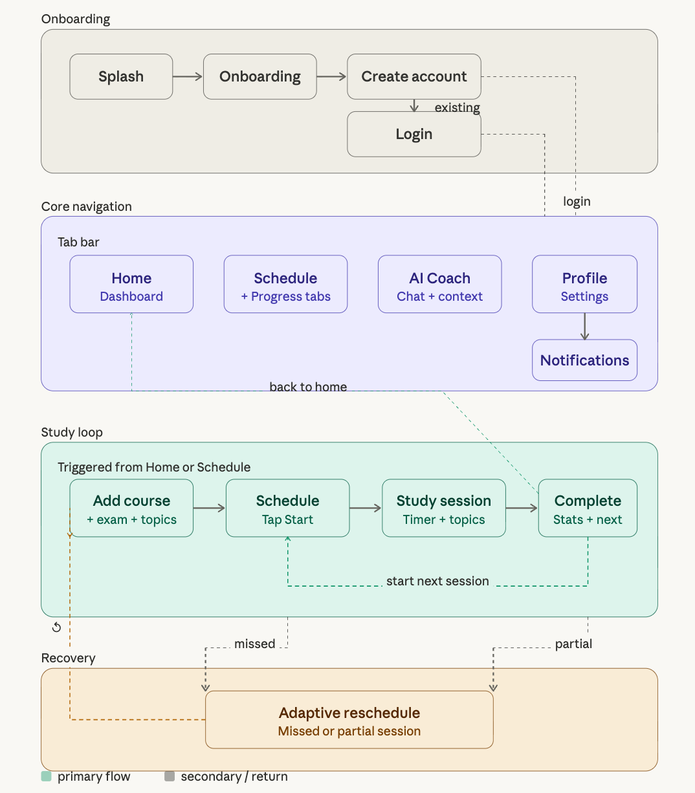

# CS310 Project Smart Study Planner

A mobile application designed to transform how students prepare for exams

## Description

Smart Study Planner is a Flutter-based mobile app that automatically generates personalized study schedules based on a student's courses, exam dates and daily availability. It includes an AI Study Coach that answers questions like " What should I focus on today?" using the user's actual data and an adaptive rescheduling feature that redistributes missed sessions automatically.

## Team Members

| Name | Student ID | Role |
|------|------------|------|
| Mehmet Ali Atagün | 29481 | Project Coordinator |
| Begüm Özcan | 33854 | Documentation & Submission Lead |
| Salih Kobaş | 30757 | Integration & Repository Lead |
| Helin Yağmur Çağine | 22580 | Testing & Quality Assurance Lead |
| Zeynep Sezin Apaydın | 30739 | Presentation & Communication Lead |
| Harun Can Yurdagül | 32092 | Learning & Research Lead |

## Tech Stack

- **Framework:** Flutter (Dart)
- **AI Integration:** LLM-based study coach, OpenAI API
- **Database:** Firebase

## UX Flow

## Features
- Personalized study schedule generation
- AI study coach for daily guidance
- Adaptive rescheduling for missed sessions
- Progress tracking and dashboard view
- Notifications for exams, streaks, and schedule changes
- Daily session flow with completion feedback

## Implemented Screens
- **Splash:** first entry screen
- **Onboarding:** introduces the app flow
- **Create Account / Login:** authentication flow
- **Home Dashboard:** overview of goals, exams, and tasks
- **Add Course:** collects course and exam information
- **Schedule:** shows planned study sessions
- **AI Coach:** gives personalized study suggestions
- **Notifications:** shows reminders and updates
- **Profile:** account and settings management
- **Daily Session / Session Complete:** supports focused study flow

## Course

CS310 - Mobile Application Development | Spring 2025-2026
